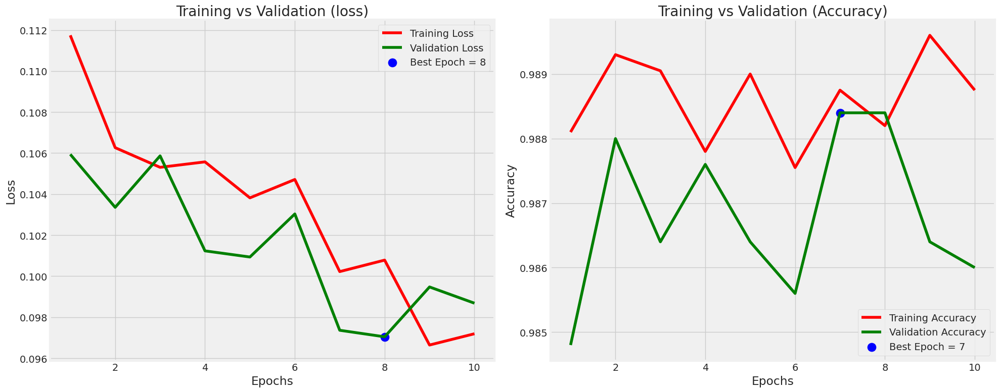
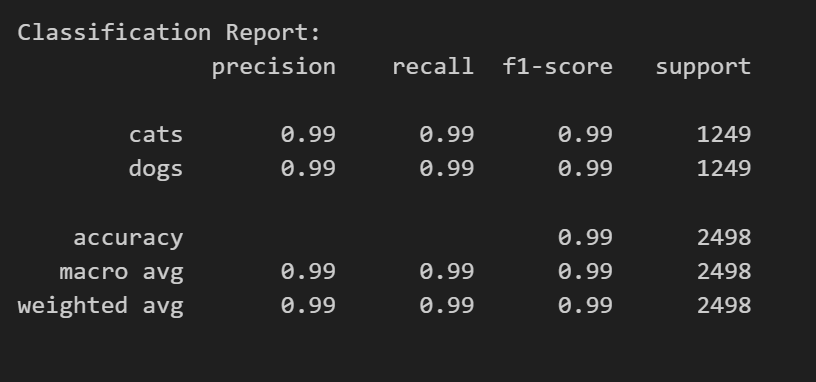
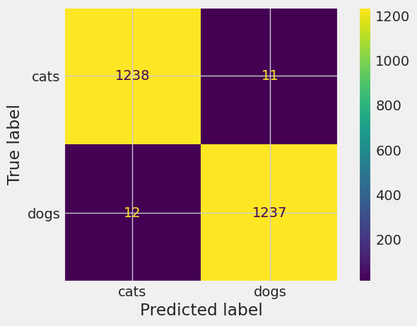

# EfficientNetB5 Dogs vs. Cats Classification

The goal of the project is to create a model capable of distinguishing between images of dogs and cats. EfficientNet is a family of convolutional neural networks (CNNs) that have been designed to achieve better performance with fewer parameters compared to traditional architectures. 

## Data Source

```bash
https://www.kaggle.com/competitions/dogs-vs-cats
```

## Steps: 
Data Collection: Gather a dataset of labeled images containing both dogs and cats.

Data Preprocessing: Prepare the images for training by resizing, normalizing, and augmenting the data to enhance the model's ability to generalize.

Model Selection: In this case, I have chosen the EfficientNetB5 architecture, and fine-tuned it for the specific task.

Training: Train the model using the prepared dataset, adjusting hyperparameters, and monitoring performance on a validation set to prevent overfitting.

Evaluation: Evaluate the model on a separate test set to assess its generalization performance.

## Achievement 

Achieved 98% accuracy and successfully implemented the concept of transfer learning.

## Training vs Validation: 



## Accuracy: 




